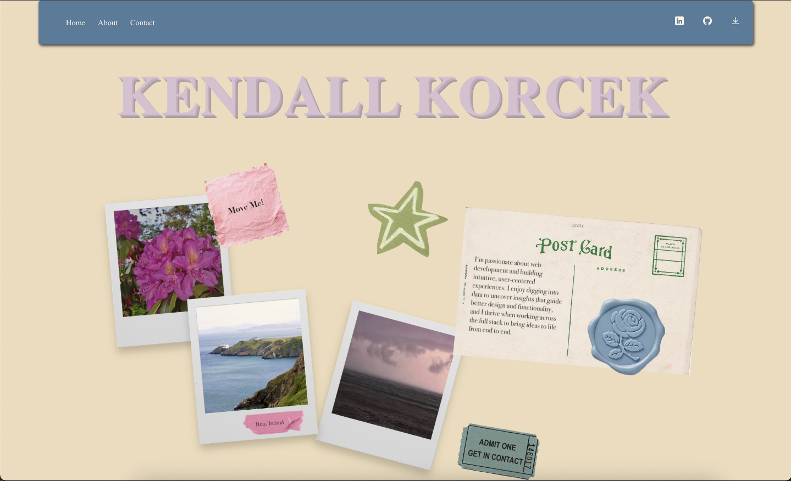

# Kendall Korcek – Personal Web App Portfolio

Welcome to my personal web app! This project serves as an interactive portfolio showcasing my development skills, personal projects, design inspirations, and contact information. Built with modern web technologies, it's designed to be visually engaging and responsive across devices.

---

## Preview

<!--  -->
<p align="center">
  
</p>

[Live Site ➝](https://kendallkorcek.com)

---

## Built With

- **React.js** – UI components & layout
- **React Draggable** – Interactive sticky notes
- **React Router** – Page navigation
- **CSS Modules / SCSS** – Styling
- **Amazon Web Services (AWS)** – Hosting & backend (if applicable)

---

## Features

- Interactive sticky note board
- Dynamic themed icons with hover effects
- Responsive mobile layout
- Custom routing for About, Projects, and Contact pages
- Linked social media, GitHub, and resume download
- Personal photos and design elements created with Figma

---

## Installation

Clone the repo and run locally:

```bash
git clone https://github.com/kkorcek/KendallKorcek.git
cd KendallKorcek
npm install
npm run dev
```
